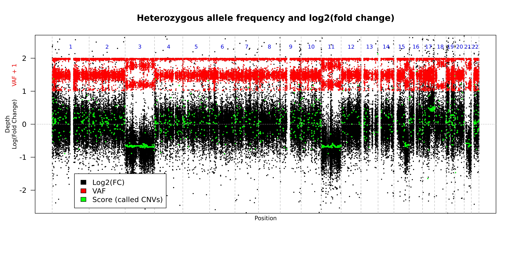

# [CNV Radar](https://https://github.com/ExpressionAnalysis/CNV_Radar/)

CNV Radar is a software tool that utilizes next-generation sequencing read depth information and variant allele frequency patterns, to infer the true copy number status of genes and genomic regions from whole exome sequencing data. It was developed by Q<sup>2</sup> Solutions | EA Genomics in collaboration with Janssen Pharmaceutical Companies of Johnson & Johnson. The software takes a BAM (reads aligned to the genome) and an annotated VCF (variant call format 4.2) as inputs for the tool. CNV Radar is capable of detecting abnormalities such as amplifications and homozygous/heterozygous deletions. It can also detect copy-neutral loss of heterozygosity that elude other approaches. 

CNV Radar is now published in [_BMC Bioinformatics_](https://bmcbioinformatics.biomedcentral.com/articles/10.1186/s12859-020-3397-x) on March 6th, 2020. 

## Table of contents
* [Requirements](#requirements)
* [Installation](#installation)
* [Usage](#usage)
* [Examples](#examples)
* [Input file list format](#input-formats)
* [Output](#output)
* [Authors](#authors)
* [Acknowledgments](#acknowledgments)

## Requirements
This package was tested using R version 3.3.2 and bedtools v2.24.0 on the linux command line
#### 1) Software environment
```
- Unix/Linux System
- Python 3
- bedtools 2.24.0 or above
- snpEff/snpSift v4.3t or above
- R 3.3.2 or above 
```
* Required R packages
```
- getopt
- yaml
- data.table
- R.utils
```

#### 2) Required inputs
* BAM file
* VCF output in variant call format 4.2

#### 3) Additional files
* For running bam2roi.r
```
- A bed file (.bed) that lists the genomic regions targeted by the exome capture kit used during library preparation. 
```
* dbSNP annotations
```
- hg19 : 
-   ftp://ftp.ncbi.nih.gov/snp/organisms/human_9606_b151_GRCh37p13/VCF/All_20180423.vcf.gz
-   ftp://ftp.ncbi.nih.gov/snp/organisms/human_9606_b151_GRCh37p13/VCF/All_20180423.vcf.gz.tbi 
- hg38 : 
-   ftp://ftp.ncbi.nih.gov/snp/organisms/human_9606_b151_GRCh38p7/VCF/All_20180418.vcf.gz
-   ftp://ftp.ncbi.nih.gov/snp/organisms/human_9606_b151_GRCh38p7/VCF/All_20180418.vcf.gz.tbi
```

## Installation
#### 1) Docker
We have provided a docker that will allow you to run CNV Radar.
```
docker pull eagenomics/cnvradar:v1.2.0
```

or

#### 2) Local Installation
Install Bedtools following the recommended installation instructions
* https://bedtools.readthedocs.io/en/latest/content/quick-start.html


Install snpEff/snpSift following the recommended installation instructions
* https://pcingola.github.io/SnpEff/download/

Setup annotation databases
```
# For hg19
java -jar /usr/local/bin/snpEff/snpEff.jar download GRCh38.GRCH37_VERSION 75
mkdir -p /usr/local/bin/snpEff/db/GRCh37/dbSnp
cd /usr/local/bin/snpEff/db/GRCh37/dbSnp
wget --no-check-certificate ftp://ftp.ncbi.nih.gov/snp/organisms/human_9606_b151_GRCh37p13/VCF/All_20180423.vcf.gz
wget --no-check-certificate ftp://ftp.ncbi.nih.gov/snp/organisms/human_9606_b151_GRCh37p13/VCF/All_20180423.vcf.gz.tbi
wget --no-check-certificate ftp://ftp.ncbi.nih.gov/snp/organisms/human_9606_b151_GRCh37p13/VCF/All_20180423.vcf.gz.md5
md5sum --check All_20180423.vcf.gz.md5

# For GRCh38
mkdir -p /usr/local/bin/snpEff/db/GRCh38/dbSnp
cd /usr/local/bin/snpEff/db/GRCh38/dbSnp
wget --no-check-certificate ftp://ftp.ncbi.nih.gov/snp/organisms/human_9606_b151_GRCh38p7/VCF/All_20180418.vcf.gz
wget --no-check-certificate ftp://ftp.ncbi.nih.gov/snp/organisms/human_9606_b151_GRCh38p7/VCF/All_20180418.vcf.gz.tbi
wget --no-check-certificate ftp://ftp.ncbi.nih.gov/snp/organisms/human_9606_b151_GRCh38p7/VCF/All_20180418.vcf.gz.md5
md5sum --check All_20180418.vcf.gz.md5
```

Install R following the recommended installation instructions
* https://cran.r-project.org/
* For Ubuntu users: https://cran.r-project.org/bin/linux/ubuntu/README.html

Install required R packages
```
R
install.packages('getopt')
install.packages('data.table')
install.packages('R.utils', dependencies = T)
install.packages('yaml', dependencies = T)
```


Install CNV Radar
```
wget --no-check-certificate https://github.com/ExpressionAnalysis/CNV_Radar/archive/master.zip -O /opt/CNVRadar.zip
unzip /opt/CNVRadar.zip -d /opt/CNVRadar
```


## Usage
Here is a flow diagram showing the processing of samples through the CNV Radar workflow. 

<p align="left">
  
</p>

The example usage provided here utilize the provided docker. If you chose to do the local install the commands will vary based on where you installed the software. Thus the user will need to modify these commands accordingly. 

#### 1) Generate a summary of the depths across the regions of interest (ROI) for each sample
```
Usage: 
docker pull <docker repo>/cnvradar:v1.2.0; 
cd <working directory>
docker run --rm -v ${PWD}:/data -w /data -t <docker repo>/cnvradar:v1.2.0 Rscript /opt/CNV_Radar/bam2roi.r -b <bam file>.bam -d <bed file>.bed -z >> bam2roi.log 2>&1
```

* Required arguments
```
-b FILE		A bam file for the sample
		      Input bam files need to be sorted by coordinates and indexed.

-d FILE		A three column bed format file that lists the locations of the regions targeted for capture  
```
* Optional arguments
```
-f FUNC	  	Function to use for summarizing depth. (Possible: median (default) or mean)
-j jobsch	Prefix to use for using a job scheduler (Default = "")
-o DIR		An output directory
-z        	A flag that indicates providing more verbose logging
```

#### 2) Annotate a VCF to identify 'common' SNPs
```
Usage: 
docker pull <docker repo>/cnvradar:v1.2.0; 
cd <working directory>
docker run --rm -v ${PWD}:/data -v <path to downloaded dbSNP annotation directory>:/annotations -w /data -t <docker repo>/cnvradar:v1.2.0 java -jar /usr/local/bin/snpEff/SnpSift.jar annotate /annotations/All_20180423.vcf.gz <VCF file> | bgzip > ${X%.vcf.gz}_ann.vcf.gz
```

For required and optional parameters, please view the official SnpSift documentation
* https://pcingola.github.io/SnpEff/ss_annotate/


#### 3) Create a control dataset using normal samples:
```
docker pull <docker repo>/cnvradar:v1.2.0; 
cd <working directory>
docker run --rm -v ${PWD}:/data -w /data -t <docker repo>/cnvradar:v1.2.0 Rscript /opt/CNV_Radar/CNV_Radar_create_control.r --directory /data -r <Suffix to identify ROI summaries files> >> create_normal_cohort.log 2>&1"
```

* Required arguments
```
-d DIR	A directory with all of the ROI summaries for the normal control samples
```
* Optional arguments
```
-r 	Suffix pattern for the ROI summary file (Character, Default = '_roiSummary.txt')
-o    	A name to give the output file
-p DIR	An output directory
```

#### 4) Run CNV Radar:
```
docker pull <docker repo>/cnvradar:v1.2.0; 
cd <working directory>
docker run --rm -v ${PWD}:/data -w /data -t <docker repo>/cnvradar:v1.2.0 Rscript /opt/CNV_Radar/CNV_Radar.r -c <Control Cohort>.RData -r <tumor sample ROI Summary>.txt -v <tumor sample annotated VCF>.vcf.gz -G 
```

* Required arguments
```
-c FILE	The path to the RData object created in step 3
-r FILE	The path to the ROI summary created in step 1
-v FILE	The path to the annotated VCF file created in step 2
```
* Optional arguments
```
-f FILE   The path to the config file of model parameters (Default = /opt/CNV_Radar_config.yml)
-o    		A name to give the output file (Default = The name of the vcf file up to but not indcluding the .vcf.gz extension)
-p DIR		An output directory (Default = directory where the script is run from)
-n        The word "all" for whole genome plotting or a comma separated list of which chromosomes to plot (Default = "all", example 1,2,5,7,20,22)
-x FLOAT  Number indicating the relative size of text and symbol plotting relative to 1 (Default = 0.35)
-A        A flag that indicates NOT filtering to only 'common' variants
-G        A flag that indicates that variant calling was done using GATK
-L        A flag that indicates running CNV Radar in standard instead of high sensitivity mode (for legacy purposes)
-C        A flag that indicates to omit plotting called CNV events on the plots
-D        A flag that indicates plotting the smoothed log2(FC) depths across the ROIs
-V        A flag that indicates plotting the smoothed heterozygous VAF across the ROI
-W        A flag that indicates writing out the table of filtered variants used in the analysis
```

### 5) Creation of ROI dendrograms (Optional):
```
docker pull <docker repo>/cnvradar:v1.2.0
cd <working directory>
docker run --rm -v ${PWD}:/data -w /data -t <docker repo>/cnvradar:v1.2.0 Rscript /opt/CNV_Radar/CreateROI_dendrograms.r -b /data -d <Output name> -r .roiSummary.txt
```

* Required arguments
```
-b DIR	The path of the directory that has all sample ROI summaries created in step 1
-d 	Output file name to which '.dendrogram_all.jpeg' will be appended
```
* Optional arguments
```
-m INT	Minimum depth required to be considered (Default = 10)
-r    	Suffix pattern for the ROI summary file (Character, Default = '_roiSummary.txt')
-p DIR	An output directory (Default = directory where the script is run from)
```

## Input Formats
#### 1) BAM
A standard BAM file as defined here: https://samtools.github.io/hts-specs/SAMv1.pdf
#### 2) VCF
A version 4.2 formatted VCF file as defined here: https://samtools.github.io/hts-specs/VCFv4.2.pdf
#### 3) BED
A headerless bed file with only the three required columns (chrom, chromStart, chromEnd) as defined here: https://genome.ucsc.edu/FAQ/FAQformat.html#format1

## Examples


#### 1) Create summary of the depths for each targeted region

## Output
There are two primary outputs from the tool: genomic plots in jpeg format and a PREFIX.CNVRadar.tsv output
#### 1) PREFIX.CNVRadar.tsv
This output file lists the copy number status for the supplied sample

* Format of the output file

|     Column     | Description                                                                                           |
|:--------------:|-------------------------------------------------------------------------------------------------------|
|       Chr      | Chromosome where the event occurs                                                                     |
|      Start     | Left most base pair in the CNV event                                                                  |
|      Stop      | Right most base pair in the CNV event                                                                 |
|     log2FC     | The log2 transformed fold change for the CNV event                                                    |
|     QScore     | The score used to identify CNV events [Bounded smoothed allele frequency x (smoothed fold change x 20)] |
| Observed Depth | The observed mean depth across the CNV event                                                          |
| Expected Depth | The expected mean depth across the CNV event                                                          |
|     Zscore     | (expected fold change - observed fold change) / standard deviation of fold change                     |
|     HetVar     | Mean heterozygous allele frequency across the CNV event                                               |
|      IsCNV     | T/F whether the CNV event is a significant                                                            |
|     Length     | Total number of base pairs in the CNV event                                                           |
|   IsLOH_Only   | T/F if the CNV event is only a copy number neutral loss of heterozygousity                            |

* Example output
```
Chr  Start    Stop     log2FC  Qscore  ObservedDepth  ExpectedDepth  Zscore  HetVar  IsCNV  Length   IsLOH_Only
1    30365    30503    -0.349  -0.339  146            186.018        -2.757  0.179   TRUE   139      FALSE
1    35105    1961722  0.184   0.718   268.078        227.767        4.962   0.349   TRUE   1926618  TRUE
1    1982054  1982155  -0.73   0.052   0.5            0.829          -1.11   0.02    FALSE  102      FALSE
```

#### 2) PREFIX.iter#\_Genome\_lfc\_vaf.jpeg
This plot shows the observed depth and observed variant allele frequencies for "common" variants across the genome. The plot is created for each of the iterations of the tool (default = 3). This plot is the default graphical output when there is nothing supplied to the --printChrs argument. 

* Format of the plot

|      Color     |        Representation                                                     |
|:--------------:|---------------------------------------------------------------------------|
|      Black     | log2 fold change in depth                                                 | 
|      Red       | Observed variant allele frequency for "common" variants shifted up 1 unit | 
|      Green     | Score assigned to each seqment                                            |
|      Orange    | Predicted copy neutral variant allele frequency for the segment           | 
|      Gray      | Predicted copy neutral log2 fold change for the segment                   | 
|      Blue      | Number of the chromosome represented between the verticle dashed lines    |

* Example
<p align="left">
  
</p>

#### 3) PREFIX.Chr#\_lfc\_vaf.jpeg
When a value is supplied for the --printChrs argument, the script will create a plot similar to output 2 but for the chromosome supplied. However, the chromosome specific plot is only created during the final iteration of the analysis. 

On this plot the blue numbers represent the chromosomal position at the gray dashed line. 

* Example
<p align="left">
  
</p>

#### 4) PREFIX.filtered.vaf.txt (Optional)
When the --writeFilteredVCF is supplied then an output file is created listing the variants that remained after filtering. The first 10 columns of the output follow VCF v4.2 format and the remaining 4 columns were parsed from the information in the VCF. 

* Format of the output file

|     Column     | Description                                                                                           |
|:--------------:|-------------------------------------------------------------------------------------------------------|
|      CHROM     | Chromosome                                                                                            |
|      POS       | Chromosomal position where the variant was observed, with the 1st base of a chr having position 1     |
|      ID        | Semi-colon separated list of unique identifiers where available                                       |
|      REF       | Symbolic reference base(s) for the position                                                           |
|      ALT       | Comma separated list of symbolic alternate non-reference alleles                                      |
|      QUAL      | Phred-scaled quality score for the assertion made in ALT                                              |
|      FILTER    | PASS if this position has passed all filters and a call was made, otherwise a semicolon-separated list of codes for filters that fail|
|      INFO      | A semicolon-separated series of short keys for additiona information (annotations)                    |
|      FORMAT    | Describes the field order that the data in <Sample> is supplied                                       |
|      <SAMPLE>  | The name of the sample selected during variant calling                                                |
|      GT        | Genotype, encoded as allele values separated by either of / (unphased) or \| (phased)                 |
|      AF        | The observed variant allele frequency reported for the variant                                        |
|      DP        | The observed read depth reported for the position                                                     |
|      RGP       | The relative genome position assigned for continuous plotting across the genome                       |  

* Example
```
CHROM  POS    ID         REF  ALT  QUAL  FILTER  INFO                                                                                      FORMAT       Example                GT   AF     DP    RGP
1      14599  rs707680   T    A    .     .       DP=25;COMMON=1;GENEINFO=DDX11L1:100287102|WASH7P:653635;VC=SNV;RS=707680;dbSNPBuildID=86  GT:AD:AF:DP  0|1:23,2:0.111:25      0|1  0.111  25    14599
1      14930  rs6682385  A    G    .     .       DP=390;COMMON=1;GENEINFO=WASH7P:653635;RS=6682385;VC=SNV;dbSNPBuildID=116                 GT:AD:AF:DP  0/1:215,159:0.418:374  0/1  0.418  374   14930
```


#### 5) PREFIX.dendrogram_all.jpeg (Optional)
This is an image produced by the CreateROI_dendrograms.r script. The script performs hierarchical clustering on the samples based on read depth. 

* Example
<p align="left">
  
</p>

## Feedback
Yes! Please give us your feedback, raise issues, and let us know how the tool is working for you. Pull requests are welcome.

## Authors
Software developers: Jeran Stratford & Chad Brown

## Acknowledgments
We'd like to thank all of the employees at Expression Analysis that participated in the development of the tool, especially Dr. Wendell Jones. 
