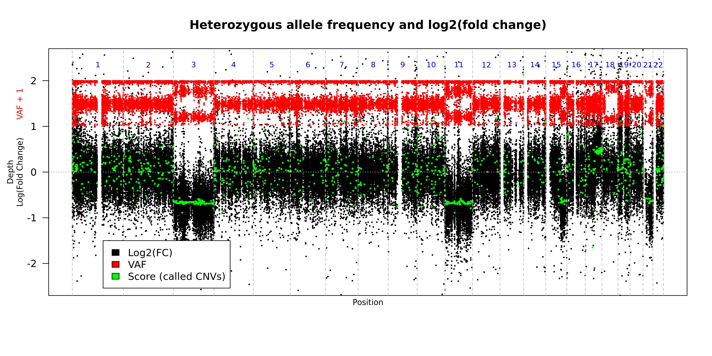

# Examples of how to run CNV Radar on publicly available data from the Texas Cancer Research Biobank
Author: Jeran Stratford

Date: October 2, 2020

## Table of contents
* [Introduction](#introduction)
* [System Requirements](#system-requirements)
* [Docker Usage](#dockers-used-in-the-vignette)
* [Data](#data-source)
* Required inputs and supporting file
  * [Capture Region Definitions](#retrieve-the-definitions-for-the-captured-regions)
  * [Reference Genome](#retrieve-the-hg19-reference-genome) 
  * [Variant Annotations](#retrieve-the-variant-annotations)
* [BAM Generation](#read-alignment)
* [VCF Generation](#generate-a-vcf-file-for-each-sample)
* [VCF Annotation](#annotate-the-vcf-file)
* [Running CNV Radar](#running-cnv-radar)
* [Data Exploration](#explore-the-data)
* [Utility](#interpretation)

## Introduction
CNV Radar is a copy number variant detection algorithm for use with targeted Next Generation Sequencing (NGS) data. This vignette is a basic guide to begin exploring the use of CNV Radar. This vignette uses publicly available data. We can explore copy number variation in tumor samples. 

## System requirements
1. Linux environment
2. git
```
apt update
apt install git
```
3. wget
```
apt-get install wget
```
4. Decrompression software
```
apt install bzip2
apt install unzip
```
5. docker
* Follow instructions here: https://docs.docker.com/engine/install/ubuntu/#installation-methods

## Dockers used in the vignette
To align the sequencing files to the reference genome we recommend the docker provided by biocontainers
* https://hub.docker.com/r/biocontainers/bwa

To index files and create dictionaries using samtools we recommend the docker provided by biocontainers
* https://hub.docker.com/r/biocontainers/samtools

To call short variants we recommend the GATK docker provided by the Broad
* https://hub.docker.com/r/broadinstitute/gatk

We have provided a docker for running CNV Radar
* https://hub.docker.com/r/eagenomics/cnvradar

## Data source
The Baylor College of Medicine Human Genome Sequencing Center (HGSC) has made a great open access dataset available from participants in Texas. In a pilot Open Access (OA) project from the CPRIT-funded Texas Cancer Research Biobank (TCRB), many Texas cancer patients were willing to openly share genomic data from tumor and normal matched pair specimens. For the first time, genetic data from **seven** human cancer cases with matched normal are freely available without requirement for data use agreements nor any major restriction except that end users cannot attempt to re-identify the participants.

We are going to use this amazing resource to for this vignette. The data source is described in a 2016 publication in Nature. Information about sequencing can be found here: ~~http://txcrb.org/sequencing.html~~. **(Update, as of 09DEC2020 it seems like the txcrb.org site doesn't point to the TCRB)**

```
Specimens were sequenced on Illumina HiSeq machines, with 100 base-pair paired-end reads, to a depth of approximately 200x over the exonic regions. The exome capture design was VCRome 2.1 (see HGSC VCRome Design), supplied by NimbleGen. Mapping was to human reference build 19, verson "GRCh37-lite", using BWA(Burrows-Wheeler Aligner) subsequent base-quality recalibration and local realignment around known indel sites was performed by GATK. See the individual file metadata or BAM headers for exceptions, version numbers, and/or extra information.
```

Becnel, L., Pereira, S., Drummond, J. et al. An open access pilot freely sharing cancer genomic data from participants in Texas. Sci Data 3, 160010 (2016). https://doi.org/10.1038/sdata.2016.10 

#### Retrieving the Sequencing Data

**UPDATE, as of 09DEC2020 it seems like the link to txcrb.org/open.html doesn't point to the biobank anymore, however the FTP listed below might still work if you can get an account setup??? However, the data appears to be available on DNA Nexus https://dnanexus.github.io/tcrb-data/**

```diff
- From a web browser navigate to the webpage for the Baylor College of Medine HGSC (https://www.hgsc.bcm.edu/)
- Scroll down to the section detailing the Open Access Pilot for the TCRB and click the link for Access data or use this link http://txcrb.org/open.html
- Follow the instructions for setting up an account 
- Log in to the sftp with your credentials: https://hgsc-sftp1.hgsc.bcm.tmc.edu/webclient/Login.xhtml
- Follow the sites's instructions to download the whole exome sequencing data to a linux environment capable of running dockers
```

```
cd ~/
mkdir -p CNVRadar_vignette/samples
cd CNVRadar_vignette/samples
<Copy the files that you downloaded here into this directory>

# Convert compression type from bz2 to gz that is compatible with BWA
for X in *.fastq.bz2; do bunzip2 -c < $X | gzip -c > ${X%.bz2}.gz; done
```


## Required inputs and supporting file

#### Retrieve the definitions for the captured regions
* CNV Radar requires a plain text tab delimited BED file which list the genomic coordinates for the portion of the genome that is capture by the probes used for library preparation. These files may be used to explore design targets and to assess capture performance within the targeted regions. The first 3 columns are chromosome or sequence name, target start (0-based), and target end (1-based).
* The sequencing libraries for these samples were prepared using the the Nimblegen (now acquired by Roche) VCRome 2.1 capture design. 
  * The capture region is described here: ~~http://www.nimblegen.com/products/seqcap/ez/designs~~
  * The bed file has been supplied within this repository: VCRome_2_1_hg19_primary_targets.bed.gz  
    * If you want to retrieve the bed file yourself you can follow this code
```
cd ~/
mkdir -p CNVRadar_vignette/supporting_files
cd ~/CNVRadar_vignette/supporting_files
wget -c https://sftp.rch.cm/diagnostics/sequencing/nimblegen_annotations/ez_hgsc_vcrome/VCRome_2.1_design_files.zip
unzip VCRome_2.1_design_files.zip
```

#### Retrieve the hg19 reference genome
* Gencode maintains a repository of fasta files for the human genome that can be used for alignment. 
```
cd ~/CNVRadar_vignette/
mkdir references
cd references
wget -c ftp://ftp.ebi.ac.uk/pub/databases/gencode/Gencode_human/release_34/GRCh37_mapping/GRCh37.primary_assembly.genome.fa.gz

# Decompress
gunzip GRCh37.primary_assembly.genome.fa.gz
```

#### Create indexes and dictionaries for the reference genome
```
cd ~/CNVRadar_vignette/references
# Index the reference for alignment
docker pull biocontainers/bwa:v0.7.17_cv1
docker run --rm -v ~/CNVRadar_vignette/references:/references -w /references -t biocontainers/bwa:v0.7.17_cv1 bwa index -p GRCh37.primary_assembly.genome GRCh37.primary_assembly.genome.fa > bwaindex.log 2>&1

# Index the reference for variant calling
docker pull biocontainers/samtools:v1.9-4-deb_cv1
docker run --rm -v ~/CNVRadar_vignette/references:/references -w /references -t biocontainers/samtools:v1.9-4-deb_cv1 samtools faidx GRCh37.primary_assembly.genome.fa > samtoolsindex.log 2>&1

# Create a dictionary of the fasta file
docker run --rm -v ~/CNVRadar_vignette/references:/references -w /references -t biocontainers/samtools:v1.9-4-deb_cv1 samtools dict GRCh37.primary_assembly.genome.fa > GRCh37.primary_assembly.genome.dict 2> samtoolsdict.err
```

#### Retrieve the variant annotations
* CNV Radar uses the variant allele frequency (VAF) for common heterozygous variants for calling CNVs. We use snpEff to annotate the VCF file with the necessary annotations so that the software can identify those positions. 
* The annotations that we use are from dbSNP
```
cd ~/
mkdir -p CNVRadar_vignette/annotations
cd ~/CNVRadar_vignette/annotations
wget --no-check-certificate ftp://ftp.ncbi.nih.gov/snp/organisms/human_9606_b151_GRCh37p13/VCF/All_20180423.vcf.gz
wget --no-check-certificate ftp://ftp.ncbi.nih.gov/snp/organisms/human_9606_b151_GRCh37p13/VCF/All_20180423.vcf.gz.tbi
wget --no-check-certificate ftp://ftp.ncbi.nih.gov/snp/organisms/human_9606_b151_GRCh37p13/VCF/All_20180423.vcf.gz.md5
md5sum --check All_20180423.vcf.gz.md5
```

## Read Alignment
#### Generate a SAM file for each sample
```
cd ~/CNVRadar_vignette/samples
docker pull biocontainers/bwa:v0.7.17_cv1
# You have to setup the readgroup or GATK variant calling will not function properly
for X in *read1.fastq.gz; do sm=${X%.read*}; HEADER=$(zcat $X | head -n1); id=$(echo $HEADER | cut -f 3-4 -d ":" | sed 's/:/_/g'); barcode=$(echo $HEADER | grep -Eo "[ATGCN]+$"); RG=$(echo "@RG\tID:${id}\tPU:${id}_${barcode}\tLB:${id}_${barcode}\tSM:${sm}\tPL:ILLUMINA"); docker run --rm -v ${PWD}:/data -v ~/CNVRadar_vignette/references:/references -w /data -t biocontainers/bwa:v0.7.17_cv1 bwa mem -M -t 16 -R $RG /references/GRCh37.primary_assembly.genome $X ${X%1.fastq.gz}2.fastq.gz > ${X%.read*}.sam 2>> ${X%.read*}.bwa.log; done
```

#### Convert the SAM file into a compressed sorted BAM file
* Note that the SAM file was generated with a redirect so there may be messages from BWA that are in the "sam" file and need to be removed before samtools can view it properly. 
  * BWA status updates can be easily identified as they have a common prefix \[M:: so a grep -v can be used to remove them
* When using the docker I found that the sam file has carriage returns at line end. This caused problems for Mutect2 variant calling
```
cd ~/CNVRadar_vignette/samples

# Remove the carriage returns
for X in *sam; do sed -i 's/\r$//g' ${X} > ${X%sam}remove_cr.log 2>&1; done

docker pull biocontainers/samtools:v1.9-4-deb_cv1
for X in *.sam; do docker run --rm -v ${PWD}:/data -w /data -t biocontainers/samtools:v1.9-4-deb_cv1 grep -v ^\\[ $X | samtools view -bS -h - > ${X%.sam}.bamf 2>> ${X%sam}bwa.log; done 

for X in *bamf; do docker run --rm -v ${PWD}:/data -w /data -t biocontainers/samtools:v1.9-4-deb_cv1 samtools sort -@ 3 -m 2000M ${X} -o ${X%.bamf}.bam >>${X%bamf}bwa.log 2>&1; done;

rm *sam *bamf
```

#### Index the bam files
```
cd ~/CNVRadar_vignette/samples
docker pull biocontainers/samtools:v1.9-4-deb_cv1
for X in *bam; do docker run --rm -v ${PWD}:/data -w /data biocontainers/samtools:v1.9-4-deb_cv1 samtools index $X; done
```

## Generate a VCF file for each sample
We recommend using GATK for calling small variants for the data
```
cd ~/CNVRadar_vignette/samples
docker pull broadinstitute/gatk:4.1.8.1
for X in *bam; do docker run --rm -v ${PWD}:/data -v ~/CNVRadar_vignette/references:/references -w /data -t broadinstitute/gatk gatk Mutect2 -R /references/GRCh37.primary_assembly.genome.fa -I $X -O ${X%bam}single_sample.vcf.gz > ${X%bam}mutect2.log 2>&1; done
```

** THIS IS THE PLACE THAT WE ASSUME USERS WILL BE WHEN THEY COME TO USE CNV RADAR WITH THEIR OWN DATA **

## Annotate the VCF file
Annotate the VCF with dbSNP annotations
```
cd ~/CNVRadar_vignette/samples
docker pull eagenomics/cnvradar:v1.2.1
for X in *single_sample.vcf.gz; do docker run --rm -v ${PWD}:/data -v ~/CNVRadar_vignette/annotations:/annotations -w /data -t eagenomics/cnvradar:v1.2.1 java -jar /usr/local/bin/snpEff/SnpSift.jar annotate /annotations/All_20180423.vcf.gz $X | bgzip > ${X%.vcf.gz}_ann.vcf.gz 2> ${X%single_sample.vcf.gz}vcf_annotation.log; done
```

## Running CNV Radar
#### Generate a summary of the read depths across the capture region
```
# Bedtools doesn't work with a compressed bed file, also tried gzip and bgzip and both cause issues
cd ~/CNVRadar_vignette/supporting_files
gunzip VCRome_2_1_hg19_primary_targets.bed.gz

cd ~/CNVRadar_vignette/samples
docker pull eagenomics/cnvradar:v1.2.1; 
for X in *.bam; do docker run --rm -v ${PWD}:/data -v ~/CNVRadar_vignette/supporting_files:/supporting_files -w /data -t eagenomics/cnvradar:v1.2.1 Rscript /opt/CNVRadar/bam2roi.r -b $X -d /supporting_files/VCRome_2_1_hg19_primary_targets.bed -z >> ${X%bam}bam2roi.log 2>&1; done

```

#### Create the reference panel from the normal samples
```
cd ~/CNVRadar_vignette/samples
docker run --rm -v ${PWD}:/data -w /data -t eagenomics/cnvradar:v1.2.1 Rscript /opt/CNVRadar/CNV_Radar_create_control.r --directory /data -r N-WEX_roiSummary.txt >> create_normal_cohort.log 2>&1
```

#### Call CNVs
```
cd ~/CNVRadar_vignette/samples
for X in *-T-WEX_roiSummary.txt; do docker run --rm -v ${PWD}:/data -w /data -t eagenomics/cnvradar:v1.2.1 Rscript /opt/CNVRadar/CNV_Radar.r -G -D -c /data/cnvradar_normal_cohort.RData -r $X -v ${X%_roiSummary.txt}.single_sample_ann.vcf.gz > ${X%_roiSummary.txt}.CNVRadar.log 2>&1; done
```

#### Create the sample dendrogram
```
cd ~/CNVRadar_vignette/samples
docker run --rm -v ${PWD}:/data -w /data -t eagenomics/cnvradar:v1.2.1 Rscript /opt/CNVRadar/CreateROI_dendrograms.r --indir /data -o TCRB_sample_dendrogram -r _roiSummary.txt > sample_dendrogram.log 2>&1
```

## Explore the data
Probably the most informative CNV Radar output is the genome wide plot from the final iteration. PREFIX.iter3\_Genome\_lfc\_vaf.jpeg. This plot shows the two main input sources: read depth, observed variant allele frequency for heterozygous variants. 

Here is the genome wide landscape for sample TCRBOA6-T-WEX. 
<p align="left">
  
</p>

There is one black and one red point for each targeted region captured as outlined in the ROI bed file (VCRome_2_1_hg19_primary_targets.bed). The black points are the median depth across for each ROI. The red points represent the variant allele frequencies (VAF) observed across all positions within a given ROI. The green points represent the score for that region being called as a CNV event.

Homozygous deletions can be identified by observing a downward shift in read depth. However, due to the presence of non-tumor cells in the sample, we don't expect that the read depth will ever be truly absent. The VAF banding pattern will remain similar to copy neutral regions as the observed variants are coming from the non-tumor cells. 

Heterozygous deletions can be identified by observing a downward shift in the read depth and a banding pattern emerge in the observed VAFs. You can see on chromosome 3, 11, 15, and 21 that the observed VAFs do not have a strong band right at 50%. The CNV event is altering the observed VAF. 

Copy-neutral loss of heterozygousity can be identified by no observable difference in read depth but a similar VAF banding pattern seen with heterozygous deletions. Unfortunately, there aren't any readily observable CN-LOH examples for this sample.

Amplifications can be identified by observing an upward shift in the read depth and a widening of the observed VAF band or a similar banding pattern seen with heterozygous deletions. The magnitude of the CNV directly influences the degree of band separation. An example of an amplification can be found on chromosome 17. The q arm has a higher depth and a wider VAF band. There also appears to be smaller amplifications on chromosome 1 and 5. 

## Interpretation
CNV Radar can help to identify copy number changes within tumor samples. This information can help provide insight into tumor biology, evolution, and mechanisms for therapeutic intervention. 
